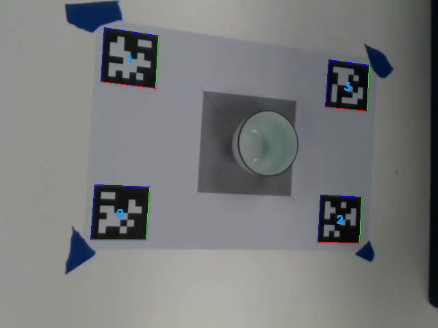
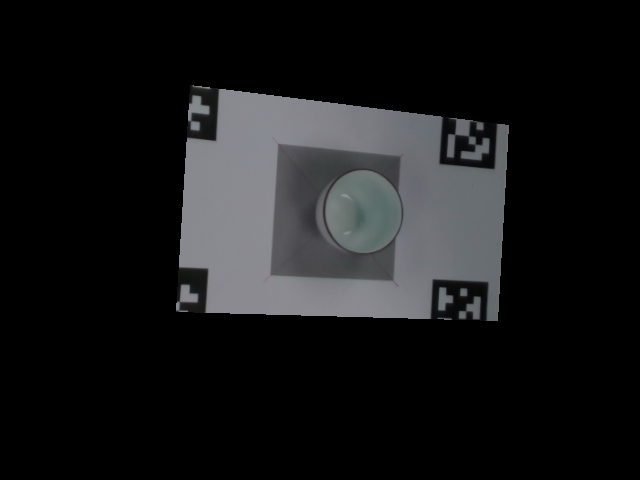
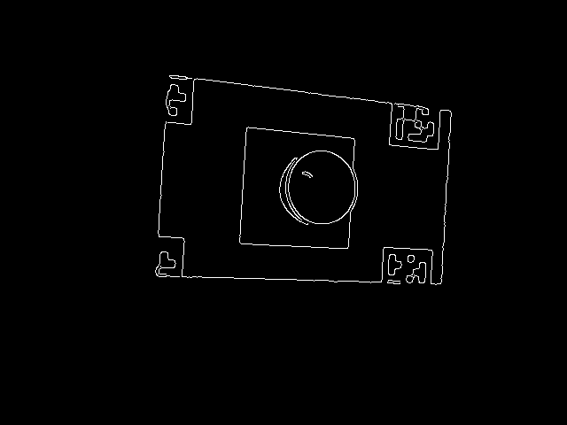
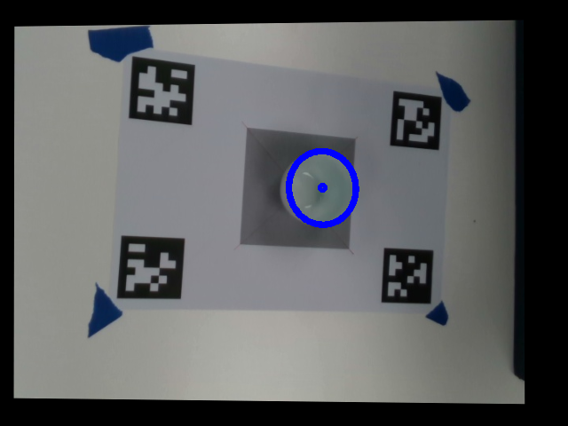
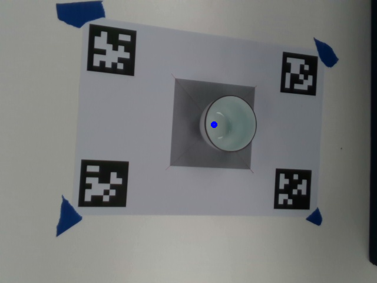

# cup_continuous_detection 说明
---
## 1.使用方法

### 1.1 安装
```
cd catkin_ws
catkin_make
```
 
### 1.2 实时运行

说明：需要链接realsense相机该程序才能进入图像接收函数然后正常运行。

```
roslaunch apriltag_ros cup_continuous_detection.launch 
```

检测到杯子在图像中的位置和在相机坐标系中的位置，发布/cup_detections话题，该话题的消息类型为geometry_msgs::Pose，反映的是杯子的位姿。

在cup_continuous_detection.launch文件中可以修改杯子的高度cup_height，低通滤波器因子beta等参数。

### 1.3只运行一张图片


说明：需要链接realsense相机该程序才能进入图像接收函数然后正常运行。

```
roslaunch apriltag_ros cup_continuous_detection.launch is_continue:=false
```


### 1.4 注意事项

测试时确保四个二维码同时检测到才会执行椭圆检测的程序。

---
## 2.工作流程
 
#### 2.1找四个二维码


 
#### 2.2提取ROI

 
#### 2.3canny边缘

 
#### 2.4提取椭圆

 
#### 2.5计算杯子底部坐标


---
## 3. 椭圆检测原理和方法

参考博客：https://blog.csdn.net/txlqy9041/article/details/83240897

椭圆检测程序源代码：https://github.com/h3ct0r/fast_ellipse_detector