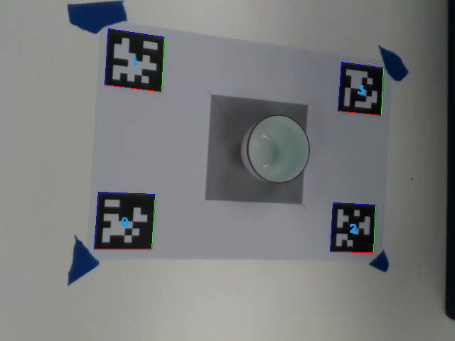
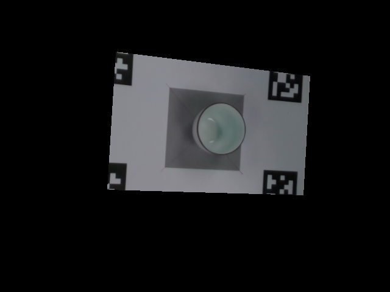
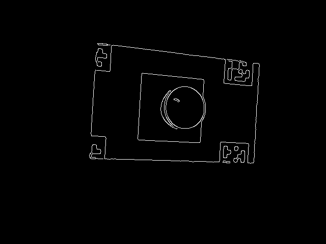
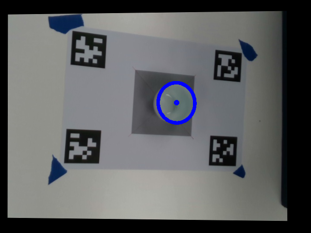
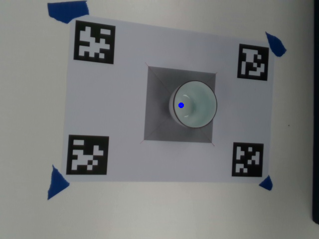

# find_cup_april 说明
---
## 1.使用方法

### 1.1 安装
```
cd catkin_ws
catkin_make
```
说明：需要提前安装apriltag_ros包，相机驱动包等。

### 1.2 实时运行

说明：需要链接realsense相机该程序才能进入图像接收函数然后正常运行。

#### 测试USB相机 

```
roslaunch apriltag_ros usb_cam_detection.launch 
roslaunch find_cup_ros find_cup_usbcam_april.launch
```
#### 测试realsense相机

```
roslaunch realsense_camera zr300_nodelet_rgbd.launch
roslaunch apriltag_ros cam_detection.launch
roslaunch find_cup_ros find_cup_realsense_april.launch
```

### 1.3 运行效果
检测到杯子在图像中的位置和在相机坐标系中的位置，发布/cup_detections话题，该话题的消息类型为geometry_msgs::Pose，反映的是杯子的位姿。

在find_cup_usbcam_april.launch文件中可以修改杯子的高度cup_height，低通滤波器因子beta等参数。

### 1.4只运行一张图片


说明：需要链接realsense相机该程序才能进入图像接收函数然后正常运行。

```
roslaunch apriltag_ros find_cup_usbcam_april.launch is_continue:=false
```


### 1.5 注意事项

测试时确保四个二维码同时检测到才会执行椭圆检测的程序。

---
## 2.工作流程
 
#### 2.1找四个二维码


 
#### 2.2提取ROI

 
#### 2.3canny边缘

 
#### 2.4提取椭圆

 
#### 2.5计算杯子底部坐标


