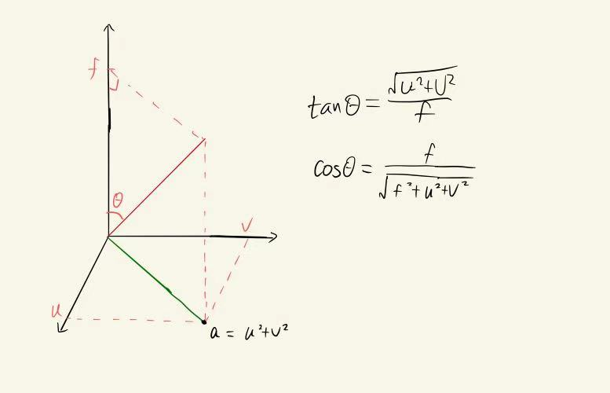
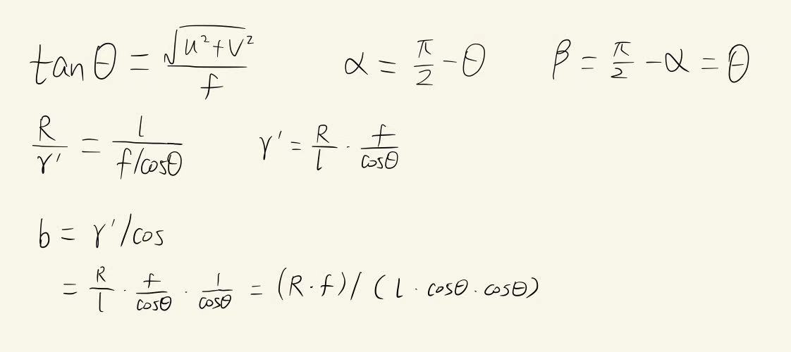

# find_cup_measure 说明
---
## 1.使用方法

### 1.1 安装
```
cd catkin_ws
catkin_make
``` 

### 1.2 单个杯子定位以及直径测量 

#### 打开相机
```
roslaunch usb_cam usb_cam-test.launch （根据自己的相机驱动进行修改)
```

#### 启动find_and_measure_cup_usbcam.launch

```
roslaunch find_cup_ros find_and_measure_cup_usbcam.launch
```

#### 发布/camera2world消息（修改相机相对于机械臂基座坐标系的位姿关系）

```
rostopic pub /camera2world geometry_msgs/Pose "position:
  x: 0.0
  y: 0.0
  z: 0.0
orientation:
  x: 0.0
  y: 0.0
  z: 0.0
  w: 0.0"
```

### 1.3 多个杯子检测与定位


#### 运行
```
roslaunch find_cup_ros find_measure_multi_cup.launch
```

---
## 2. 原理

### 2.1 检测椭圆与三维定位

参考： [cup_find_general.md](cup_find_general.md)

### 2.2 根据图像检测到的像素直径计算实际物理直径





